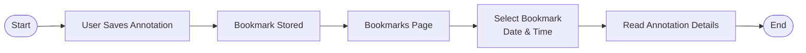

## 1. Background

Learning from physical books is still a common method for language learners, especially for professional or work-related materials. However, traditional learning requires users to constantly switch between books, dictionaries, and online resources to understand unfamiliar words or sentences.

This product enables users to **scan book pages using their mobile device**, convert the content into digital text, and **interactively highlight words or sentences** to receive contextual explanations. The MVP focuses on Japanese work-related learning materials, starting with *Shigoto Japan*, but is designed to be scalable to other languages and content types in the future.

---

## 2. Objective

The primary objective of the MVP is to validate whether users find value in **learning Japanese directly from photographed book content** using OCR and contextual annotations.

Specific goals:

- Enable fast conversion of book images into readable text
- Help users understand Japanese words or sentences in a professional context
- Allow users to save and revisit learning materials
- Deliver a usable MVP within 2 weeks

---

## 3. Success Metrics


| Metric                       | Description                                              | Target (MVP) |
| ---------------------------- | -------------------------------------------------------- | ------------ |
| User Activation Rate         | Users who complete sign-in and upload at least one photo | ≥ 60%        |
| OCR Success Rate             | Uploaded images successfully converted to readable text  | ≥ 85%        |
| Annotation Usage             | Users who highlight and view at least one annotation     | ≥ 50%        |
| Bookmark Usage               | Users who save at least one annotation                   | ≥ 30%        |
| Returning Users              | Users who revisit previously scanned content             | ≥ 25%        |
| Average Annotation Load Time | Time to display annotation result                        | ≤ 3 seconds  |


---

## 4. Assumptions

- Users are primarily **Japanese language learners for professional/work purposes**
- Users access the app mainly from **mobile devices**
- Image quality from user-uploaded photos is generally readable
- OCR accuracy for Japanese text is sufficient for MVP validation
- Initial content focus is limited to **Japanese → English** translation
- Users are comfortable signing in using Google Authentication

6.1. Requirements


| Requirement               | Description                                       | User Story                                                                                                               | Priority |
| ------------------------- | ------------------------------------------------- | ------------------------------------------------------------------------------------------------------------------------ | -------- |
| **User Authentication**   | User can sign in using Google OAuth               | As a user, I want to sign in with my Google account so that I can quickly access the app without creating a new account. | High     |
| **Image Capture**         | User can take a photo using the camera            | As a user, I want to take a photo of a book page so that I can instantly convert it into readable text.                  | High     |
| **Image Upload**          | User can upload an image from the gallery         | As a user, I want to upload an existing photo from my gallery so that I can use images I already have.                   | High     |
| **OCR Processing**        | Convert Japanese text from image to editable text | As a user, I want the app to extract text from my photo so that I can read and interact with the content digitally.      | High     |
| **Text Highlight**        | User can select words or sentences                | As a user, I want to highlight specific words or sentences so that I can focus on parts I don't understand.              | High     |
| **Annotation Generation** | System provides contextual explanations           | As a user, I want to see explanations and context for highlighted text so that I can understand its meaning and usage.   | High     |
| **Bookmark Annotation**   | User can save annotations                         | As a user, I want to bookmark annotations so that I can review them later.                                               | Medium   |
| **Annotation History**    | User can revisit previous annotations             | As a user, I want to see my past annotations so that I can continue learning without repeating the same steps.           | Medium   |
| **Scan History**          | User can view previously uploaded images          | As a user, I want to access my previous scans so that I can reread or annotate them again.                               | Medium   |
| **Language Preference**   | Default English, adjustable by user               | As a user, I want to choose my preferred explanation language so that learning feels more comfortable to me.             | Low      |


### Annotation Output Requirements


| Type                | Description                                   |
| ------------------- | --------------------------------------------- |
| Meaning             | Direct translation of the word or sentence    |
| Usage Example       | Example sentence in professional/work context |
| Usage Timing        | When and in what situation the phrase is used |
| Word Breakdown      | Explanation of each word in a sentence        |
| Alternative Meaning | Meaning in different fields or contexts       |


---

### Non-Functional Requirements


| Category    | Requirement                                          |
| ----------- | ---------------------------------------------------- |
| Performance | Annotation response time ≤ 3 seconds                 |
| Usability   | Optimized for mobile web                             |
| Security    | OAuth-based authentication                           |
| Scalability | OCR and annotation services can be extended post-MVP |
| Reliability | Saved data persists across sessions                  |


## 7. User Interface

### 7.1 User Flow

**7.1.1 Happy Flow**  
graph LR
    Start([Start]) --> OpenApp[Open App]
    OpenApp --> GoogleSignIn[Google Sign-In]
    GoogleSignIn --> Home[Home]

```
Home --> ScanHistory[Scan History]
Home --> TakePhoto[Take Photo]
Home --> UploadPhoto[Upload Photo]

TakePhoto --> OCR[OCR Processing]
UploadPhoto --> OCR

OCR --> TextPreview[Text Preview]
TextPreview --> Highlight[Highlight Word / Sentence]
Highlight --> Annotation[Annotation Result]
Annotation --> Bookmark[Save to Bookmark]
Bookmark --> Read[Read Now / Later]

Read --> End([End])

%% Optional Loops based on diagram arrows
Read --> Bookmark
Read --> ScanHistory
```

7.1.2 App Entry & Authentication
graph LR
    Start([Start]) --> OpenApp[User Opens App]
    OpenApp --> Landing[Landing Page]
    Landing --> ClickSignIn[Click "Sign in with Google"]
    ClickSignIn --> GoogleOAuth[Google OAuth]
    GoogleOAuth --> AuthSuccess{Auth Success?}

```
AuthSuccess -- YES --> Home[Home / Scan History Page]
AuthSuccess -- NO --> ClickSignIn

Home --> End([End])

style AuthSuccess fill:#fff,stroke:#333,stroke-width:2px
linkStyle 5 stroke:#28a745,stroke-width:2px,color:#28a745
linkStyle 6 stroke:#dc3545,stroke-width:2px,color:#dc3545
```

7.1.2 Image Capture / Upload Flow
graph LR
    Start([Start]) --> Home[Home / Scan History]
    Home --> TakePhoto[Take Photo]
    Home --> UploadGallery[Upload from Gallery]

```
TakePhoto --> ImageCaptured[Image Captured]
UploadGallery --> ImageSelected[Image Selected]

ImageCaptured --> Validation{Image Validation}
ImageSelected --> Validation

Validation -- YES --> OCR[OCR Processing]
Validation -- NO --> Retake[Retake / Reselect]

OCR --> OCRSuccess{OCR Success?}

OCRSuccess -- YES --> TextPreview[Text Preview Screen]
OCRSuccess -- NO --> Retake

Retake --> Home
TextPreview --> End([End])

style Validation fill:#fff,stroke:#333,stroke-width:2px
style OCRSuccess fill:#fff,stroke:#333,stroke-width:2px
linkStyle 5 stroke:#28a745,stroke-width:2px,color:#28a745
linkStyle 6 stroke:#dc3545,stroke-width:2px,color:#dc3545
linkStyle 8 stroke:#28a745,stroke-width:2px,color:#28a745
linkStyle 9 stroke:#dc3545,stroke-width:2px,color:#dc3545
```

7.1.3 Text Interaction & Annotation Flow (Core Value)
graph TD
    Start([Start]) --> TextPreview[Text Preview Screen]
    TextPreview --> Highlight[User Highlights Word / Sentence]
    Highlight --> Valid{Highlight Valid?}

```
Valid -- NO --> Hint[Show Hint / Adjust Selection]
Hint --> Highlight

Valid -- YES --> Processing[Annotation Processing]
Processing --> Result[Annotation Result]

subgraph AnnotationDetails [Annotation Details]
    Meaning[Meaning]
    Usage[Usage Example]
    WhenToUse[When to Use]
    Breakdown[Word Breakdown]
    Alt[Alternative Meanings]
end

Result --- AnnotationDetails
Result --> Action[User Action]

subgraph Actions [Available Actions]
    Save[Save to Bookmark]
    HighlightAgain[Highlight Another Text]
    BackHistory[Back to History]
end

Action --- Actions
Action --> End([End])

style Valid fill:#fff,stroke:#333,stroke-width:2px
linkStyle 2 stroke:#dc3545,stroke-width:2px,color:#dc3545
linkStyle 4 stroke:#28a745,stroke-width:2px,color:#28a745
```

7.1.4 Bookmark & History Flow



## 9. Out of Scope (MVP)

- Native mobile applications (iOS / Android)
- Non-Japanese language support
- Handwriting recognition
- Real-time camera OCR (live scanning)
- Grammar exercises or quizzes
- Social sharing features
- Subscription or payment system
- Audio pronunciation (TTS)
- Teacher or community annotations