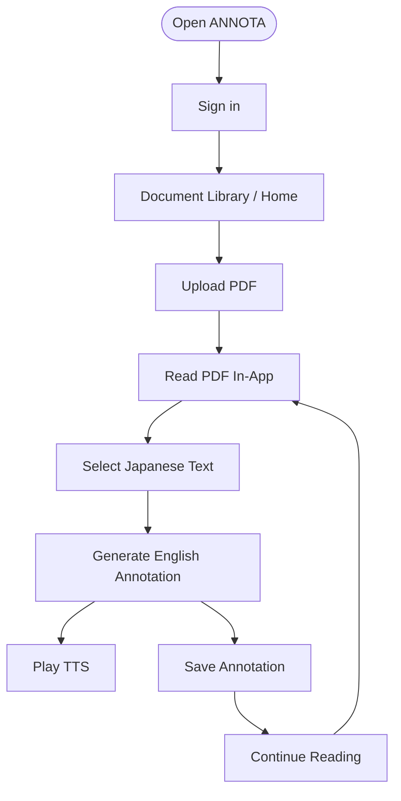
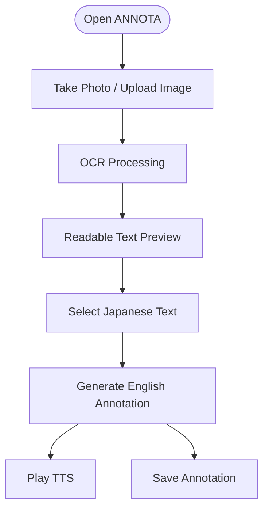
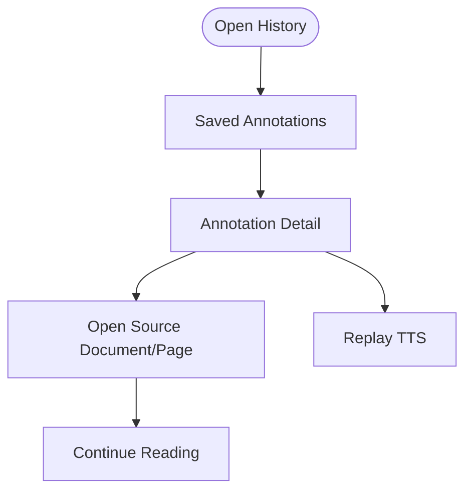

# ANNOTA Product Requirements Document

## 1. Background

Japanese learners who study from books, PDFs, and work documents often need to switch between a reader, dictionary, translator, pronunciation source, and note-taking tool. That context switching makes reading slow and breaks comprehension, especially for professional or textbook material where a phrase can mean different things depending on the surrounding paragraph.

ANNOTA is a mobile-first web reader for Japanese learning material. Users can open Japanese PDFs or scan physical book pages, read the content in-app, select words or sentences, and receive contextual English explanations, translations, pronunciation help, and text-to-speech.

The long-term product direction is a learning reader, not only an OCR demo:

1. **PDF/book reader**: open Japanese PDFs, continue reading where the user left off, and annotate text directly on the page.
2. **Camera/OCR companion**: capture physical book pages and convert them into readable text for the same annotation flow.
3. **Context-aware learning layer**: explain selected Japanese text using page, document, and professional context.
4. **Pronunciation and listening support**: show reading guidance and play natural Japanese speech for selected text.
5. **Saved learning history**: preserve annotations, source document/page context, bookmarks, and reviewed terms.

## 2. Objective

The primary objective is to help users understand Japanese reading material without leaving the document they are reading.

The product should allow a user to:

- Upload or open a Japanese PDF and read it inside ANNOTA.
- Scan or upload an image of a physical Japanese book page.
- Select a word, phrase, sentence, or paragraph.
- Get a contextual English translation and explanation.
- Understand pronunciation through kana/reading guidance and text-to-speech.
- Save annotations and return to the exact document/page context later.

## 3. Current Baseline

This PRD is written against the current codebase baseline. The implementation already includes or partially wires these product capabilities:

- Google authentication and protected routes.
- Image upload/camera OCR flow.
- PDF upload, file retrieval, PDF.js rendering, and selectable PDF text layer.
- PDF page-to-scan bridge for reusing the annotation pipeline.
- Gemini-based annotation generation.
- Gemini text-to-speech endpoint and frontend playback hooks.
- Saved annotation history and detail views.
- Document library with reading progress (`last_page_number`, `last_opened_at`) stored end-to-end.
- User language preference field exists in the user model and persists through `/v1/users/me`, but is **not yet wired into the Gemini prompt** — see Phase 1.5.

The roadmap below distinguishes current baseline, next product work, and future enhancements. It should not be read as claiming every roadmap feature is already complete.

### 3.1 Known Gaps (Phase 1.5 targets)

The following reliability and quality issues exist in the current baseline and are tracked as Phase 1.5 acceptance criteria:

- **PDF viewer performance.** `ContinuousPDFViewer` mounts all pages upfront and registers one `selectionchange` listener per page, causing O(N) handler calls per cursor move on long documents. Acceptance: virtualize off-screen pages with a single shared handler.
- **OCR scan polling disabled.** `ScanPage` passes `pollIntervalMs: 0`, so a freshly-created async scan displayed directly will spin on the loader forever without a manual reload.
- **`preferredLanguage` not reaching Gemini.** The `AnalyzeWithLanguageAPI` handler exists (`backend/internal/handlers/ai.go`) but is not routed. The active `/v1/ai/analyze` handler hard-codes English.
- **Annotation compat fields still on the wire.** `meaning`, `usageTiming`, `alternativeMeaning` are still emitted alongside the §9 richer schema with no documented migration cut-off.
- **Single AI rate-limiter shared across scan, analyze, and speech.** TTS replays consume analyze quota from the same bucket.

## 4. Target Users

**Primary persona — Non-resident Japanese learners** who read textbooks, PDFs, and book photos outside Japan and need on-demand pronunciation (TTS) and JP→EN translation without leaving the document.

Secondary personas:

- Professionals who need to understand Japanese documents quickly in context.
- Students who want translation, reading guidance, and saved notes while studying.
- Intermediate learners who can read some Japanese but need help with vocabulary, nuance, and pronunciation.

## 5. Success Metrics

| Metric | Description | Target |
| --- | --- | --- |
| Reader activation | Users who sign in and open at least one PDF, image, or camera scan | >= 60% |
| First annotation rate | Users who select text and generate at least one annotation | >= 50% |
| TTS usage rate | Users who play audio for at least one selected Japanese phrase | >= 30% |
| TTS audio cache hit rate | Replays of saved-annotation TTS that are served from cache rather than re-calling `/v1/ai/speech` | >= 60% |
| Saved learning rate | Users who save at least one annotation/bookmark | >= 30% |
| Continue-reading rate | Users who return to a previously opened document | >= 25% |
| Annotation latency | Average time to display an annotation result | <= 3 seconds |
| PDF extraction success | Text-based PDFs that provide extractable text for annotation context | >= 95% |
| OCR success | Uploaded images converted into readable Japanese text | >= 85% |
| Annotation export success rate | Export requests that complete and produce a valid file | >= 99% |

## 6. Product Principles

- **Reader-first**: the primary surface is reading Japanese material, not managing files.
- **Context over literal translation**: annotations must explain how the selected text works in the surrounding document.
- **English-first explanations**: the default target language is English. User-selectable explanation languages are a later preference feature.
- **Pronunciation is core**: reading guidance and natural TTS are part of the learning loop, not optional extras.
- **Mobile-first**: selection, annotation, and audio playback must work well on touch devices.
- **Document memory**: saved annotations should keep document/page/source context so users can return to what they were reading.

## 7. Roadmap

### Phase 1: Stabilize Current Reader, Annotation, And TTS Loop

Goal: make the existing end-to-end experience reliable and easy to understand.

- User can sign in and land on a clear reading entry point.
- User can upload a text-based Japanese PDF and read it in-app.
- User can scan or upload a book page image and read OCR text.
- User can select Japanese text from either a PDF page or OCR text preview.
- User can generate a contextual English annotation.
- User can play TTS for the selected Japanese text.
- User can save the annotation and view it in history.
- Errors for unsupported files, failed extraction, failed OCR, failed annotation, and failed TTS are clear and recoverable.

### Phase 1.5: Reader Hardening

Goal: make the reader/annotation/TTS loop trustworthy on the mobile devices the PRD calls primary before building additional features. Each item below has an acceptance criterion that blocks phase completion.

**Reliability:**

- **PDF viewer scales to long documents.** Virtualize off-screen pages; use a single shared `selectionchange` listener across all pages. Acceptance: open a 200-page PDF on mid-tier mobile; selection-response latency stays ≤ 16 ms median during cursor drag. (`web/src/components/documentpage/ContinuousPDFViewer.tsx`)
- **OCR scan polling re-enabled.** `ScanPage` polls `/v1/scans/{id}` until status is `ready` or `failed`. Acceptance: navigating directly to a freshly-created scan resolves without manual reload. (`web/src/pages/ScanPage.tsx`)
- **`preferredLanguage` wired into Gemini prompt.** The `/v1/ai/analyze` handler reads `user.PreferredLanguage` and passes it to the annotation prompt. Acceptance: changing the user's language preference in the profile changes the annotation output language. (`backend/internal/handlers/ai.go`, `backend/cmd/server/main.go`)
- **Annotation schema migration closed out.** Responses for annotations created after the migration cut-off return only the §9 richer schema fields; legacy `meaning`, `usageTiming`, `alternativeMeaning` are removed from the wire. Migration cut-off date to be documented in release notes at time of deployment. (`backend/internal/handlers/ai.go`, `backend/internal/models/annotation.go`, `web/src/pages/AnnotationDetailPage.tsx`)
- **AI rate-limiter split.** Separate rate-limit buckets for `/v1/scans`, `/v1/ai/analyze`, and `/v1/ai/speech` so TTS replay does not consume annotation-generation quota. (`backend/cmd/server/main.go`, `backend/internal/middleware/rate_limit.go`)

**Mobile-readiness:**

- **iOS safe-area honored.** Add `viewport-fit=cover` to `web/index.html`; apply `env(safe-area-inset-bottom)` to `BottomNavigation`, `BottomActionBar`, and `AnnotationDrawer`. Acceptance: no UI clipped by iPhone home-indicator.
- **Touch targets ≥ 44 px.** All interactive controls meet the 44 px minimum. Acceptance: audit passes on `WelcomePage`, `HistoryPage`, and `DocumentsPage`.
- **iOS PDF text selection.** Add a `touch-action` constraint on `.textLayer` so iOS Safari selection does not scroll the page. (`web/src/index.css`)
- **Semantic interactive elements.** Replace `
` with `<button>` where used for row-level navigation (e.g., `HistoryPage.tsx:124`).

### Phase 2: Document Library And Reading Memory

Goal: make ANNOTA useful for ongoing study, not only one-off uploads.

- User can view a document library of uploaded PDFs.
- User can continue reading from the last opened page.
- User can see document metadata: filename, page count, last opened time, and created time.
- User can view annotations scoped to a document and page.
- Saved annotations include source metadata: document ID, page number, selected text, surrounding context, and creation time.
- User can delete documents or annotations they no longer need.
- User can distinguish PDF-based annotations from image/OCR-based annotations.

### Phase 3: Pronunciation-First Learning Output

Goal: make every annotation teach both meaning and reading.

- Annotation output includes kana/reading guidance for selected text.
- Optional romaji can be shown as a learning aid, not as the primary reading system.
- TTS can be replayed from saved annotation details.
- Saved annotations show translation, explanation, reading, and source context together.
- The product can support richer speech controls later, such as slower playback or voice selection.
- Pitch accent or accent notes are future nice-to-have, not required for the first pronunciation release.

### Phase 4: Stronger Context And Advanced Document Support

Goal: improve comprehension for harder books and less clean documents.

- Annotation context can use page-level and document-level context, not only the selected text.
- The system can summarize nearby paragraph/page context for Gemini when a selection is ambiguous.
- Scanned/image-only PDFs can fall back to OCR per page.
- Offline PWA shell can support opening the app and viewing cached metadata, while OCR, annotation, and TTS remain network-backed.

### Phase 5: Outside-Japan Learner Loop

Goal: close the daily-practice loop for the primary persona — non-resident Japanese learners who need pronunciation and translation support while studying.

- **Furigana toggle.** Users can enable a persisted preference that renders kana above kanji in annotation output and (where layout permits) in OCR text previews. Gemini already returns `pronunciation.kana`; this is a UI + preference wiring task.
- **Saved-TTS audio caching.** Generated audio for an annotation is persisted so replays from the annotation detail view do not re-call `/v1/ai/speech` on every tap. Storage mechanism (blob column vs. object store) is deferred to the implementation plan. Acceptance criterion: TTS audio cache hit rate ≥ 60% on replay (see §5).
- **Annotation export.** Users can download saved annotations as an Anki-compatible CSV via `GET /v1/annotations/export?format=csv`. Acceptance: a round-trip export produces a file that imports into Anki without manual cleanup. Export success rate ≥ 99% (see §5).

## 8. Functional Requirements

| Requirement | Description | Priority | Phase |
| --- | --- | --- | --- |
| User Authentication | User can sign in with Google and access personal documents and annotations. | High | Current/Phase 1 |
| PDF Upload | User can upload a text-based PDF. | High | Current/Phase 1 |
| PDF Reader | User can read the visual PDF in-app with selectable text. | High | Current/Phase 1 |
| PDF Text Context | System can extract page text for annotation context. | High | Current/Phase 1 |
| Image Capture | User can take a photo of a physical book page. | High | Current/Phase 1 |
| Image Upload | User can upload an existing image from their device. | High | Current/Phase 1 |
| OCR Processing | System converts Japanese image text into readable text. | High | Current/Phase 1 |
| Text Selection | User can select words, sentences, or short paragraphs from PDF or OCR text. | High | Current/Phase 1 |
| Contextual Annotation | System returns English translation and explanation based on selected text plus context. | High | Current/Phase 1 |
| Text-To-Speech | System plays selected Japanese text exactly as written. | High | Current/Phase 1 |
| Save Annotation | User can save useful annotations. | High | Current/Phase 1 |
| Annotation History | User can revisit saved annotations. | Medium | Current/Phase 1 |
| Long-PDF Performance | PDF viewer virtualizes off-screen pages and uses a single shared selection handler; selection latency ≤ 16 ms median on 200-page documents. | High | Phase 1.5 |
| OCR Scan Polling | ScanPage polls scan status until ready or failed; no manual reload required after direct navigation. | High | Phase 1.5 |
| Language Preference Wiring | User's preferred language preference reaches the Gemini annotation prompt. | High | Phase 1.5 |
| Annotation Schema Migration | Legacy compat fields (meaning, usageTiming, alternativeMeaning) removed from wire; migration cut-off documented. | High | Phase 1.5 |
| AI Rate-Limiter Split | Separate rate-limit buckets for scan, analyze, and speech endpoints. | High | Phase 1.5 |
| iOS Safe-Area & Touch Targets | All bottom bars honor iOS safe-area inset; all interactive controls meet 44 px minimum touch target. | High | Phase 1.5 |
| Document Library | User can view uploaded PDFs and continue reading. | High | Phase 2 |
| Reading Progress | System stores current page and last opened time per document. | High | Phase 2 |
| Page-Aware History | Saved annotations preserve document/page/source metadata. | High | Phase 2 |
| Pronunciation Guidance | Annotation includes kana/reading and optional romaji. | High | Phase 3 |
| Saved TTS Replay | User can replay TTS from saved annotations. | Medium | Phase 3 |
| Scanned PDF OCR Fallback | Image-only PDFs can be processed with page-level OCR. | Medium | Phase 4 |
| Document-Level Context | Annotation can use broader page/book context when needed. | Medium | Phase 4 |
| Furigana Toggle | User can enable kana-over-kanji display in annotation output; preference persisted. | High | Phase 5 |
| Saved-TTS Audio Cache | Replayed TTS audio is served from cache; cache hit rate ≥ 60%. | High | Phase 5 |
| Annotation Export | User can download annotations as Anki-compatible CSV via export endpoint. | Medium | Phase 5 |
| Language Preference UI | User can choose explanation language after English-first behavior is stable. | Low | Future |

## 9. Annotation Output Requirements

The roadmap target for annotation output is:

| Field | Description |
| --- | --- |
| `translation` | Direct English translation of the selected Japanese text. |
| `contextualExplanation` | Explanation of what the text means in the surrounding page/book context. |
| `usageExample` | Example sentence or usage pattern, preferably relevant to work or study contexts. |
| `whenToUse` | When this word or phrase is appropriate, including politeness or domain nuance. |
| `wordBreakdown` | Breakdown of important words, particles, grammar, or phrase components. |
| `alternativeMeanings` | Other plausible meanings and why they do or do not fit the current context. |
| `pronunciation` | Kana/reading guidance; optional romaji; future pitch/accent notes if useful. |

Legacy compatibility fields (`meaning`, `usageTiming`, `alternativeMeaning`) remain on the wire until the Phase 1.5 schema migration cut-off. After that cut-off, only the fields above are returned for new annotations. Existing saved annotations retain their stored JSON; clients must handle both schemas for the transition period.

## 10. TTS Requirements

- TTS must play the selected Japanese text exactly as written.
- Surrounding context may be used only to infer natural tone, pacing, or pronunciation.
- TTS must not read surrounding context aloud.
- TTS should be available from the active selection in the reader.
- Saved annotation details support replaying the selected text audio (Phase 3). Audio is served from cache after Phase 5.
- Failed audio generation must not block reading or saving the annotation.

## 11. Document Reader Requirements

The document reader should support:

- PDF upload and in-app rendering.
- Selectable text layer for annotation.
- Current page indicator.
- Continue-reading progress.
- Last opened timestamp.
- Document library/list.
- Per-document annotation list.
- Page-aware annotation source metadata.
- Clear unsupported-file and extraction-failure states.

The current reader uses continuous visual PDF rendering with page visibility tracking. Future UX can add explicit page-by-page controls if user testing shows that a stricter Kindle-style flow is easier on mobile.

## 12. API Surface

The current backend uses `/v1/...` routes. Product requirements should align to that route family.

| Capability | Route Shape |
| --- | --- |
| Google auth state | `GET /v1/auth/google/state` |
| Google auth callback | `POST /v1/auth/google/callback` |
| Current user profile | `GET /v1/users/me` |
| User preferences | `PATCH /v1/users/me` |
| Scan upload | `POST /v1/scans` |
| Scan detail | `GET /v1/scans/{id}` |
| Document upload | `POST /v1/documents` |
| Document library list | `GET /v1/documents` |
| Document detail | `GET /v1/documents/{id}` |
| Document PDF file | `GET /v1/documents/{id}/file` |
| Document page text | `GET /v1/documents/{id}/pages/{pageNumber}` |
| PDF page scan bridge | `POST /v1/documents/{id}/pages/{pageNumber}/scan` |
| Update reading progress | `PATCH /v1/documents/{id}/progress` |
| Delete document | `DELETE /v1/documents/{id}` |
| Annotation generation | `POST /v1/ai/analyze` |
| Speech generation | `POST /v1/ai/speech` |
| Save annotation | `POST /v1/annotations` |
| Annotation history | `GET /v1/annotations` |
| Annotation detail | `GET /v1/annotations/{id}` |
| Annotation export | `GET /v1/annotations/export` — Phase 5 |

Future API changes should preserve backward compatibility or include a documented migration path for saved annotations.

## 13. User Flows

### 13.1 PDF Reading And Annotation

```mermaid
graph TD
    Start([Open ANNOTA]) --> SignIn[Sign in]
    SignIn --> Library[Document Library / Home]
    Library --> UploadPDF[Upload PDF]
    UploadPDF --> Reader[Read PDF In-App]
    Reader --> Select[Select Japanese Text]
    Select --> Explain[Generate English Annotation]
    Explain --> Listen[Play TTS]
    Explain --> Save[Save Annotation]
    Save --> Continue[Continue Reading]
    Continue --> Reader
```

### 13.2 Physical Book Page Flow

```mermaid
graph TD
    Start([Open ANNOTA]) --> Capture[Take Photo / Upload Image]
    Capture --> OCR[OCR Processing]
    OCR --> TextPreview[Readable Text Preview]
    TextPreview --> Select[Select Japanese Text]
    Select --> Explain[Generate English Annotation]
    Explain --> Listen[Play TTS]
    Explain --> Save[Save Annotation]
```

### 13.3 Saved Learning Flow

```mermaid
graph TD
    Start([Open History]) --> List[Saved Annotations]
    List --> Detail[Annotation Detail]
    Detail --> Source[Open Source Document/Page]
    Detail --> Replay[Replay TTS]
    Source --> Reader[Continue Reading]
```

## 14. Non-Functional Requirements

| Category | Requirement |
| --- | --- |
| Performance | Average annotation response time should be <= 3 seconds. |
| Performance | Text-based PDF page extraction should be <= 1 second per page. |
| Performance | PDF page render frame budget ≤ 16 ms median during selection drag on a 200-page document on mid-tier mobile. |
| Performance | PDF rendering should remain responsive on mobile-sized documents. |
| Usability | Selection, explanation, save, and TTS controls must be touch-friendly. |
| Usability | All interactive controls must have a minimum 44 px touch target on mobile. |
| Usability | iOS safe-area insets must be honored on all bottom bars and drawers (`env(safe-area-inset-bottom)`). |
| Reliability | Saved documents, scans, annotations, and progress persist across sessions. |
| Reliability | AI rate-limit buckets are independent across scan, analyze, and speech so one endpoint cannot starve another. |
| Security | User documents and annotations require authenticated access. |
| Privacy | User-uploaded PDFs/images should not be visible to other users. |
| Limits | Image and PDF upload limits default to 10MB unless configuration changes. |
| Accessibility | Core actions must have accessible labels and visible loading/error states. |
| Accessibility | `AnnotationDrawer` must include `role="dialog"`, `aria-modal`, and a focus trap. |
| Accessibility | `LoadingPage` must expose `role="status"` and `aria-live` so screen readers announce OCR progress. |
| Scalability | OCR, annotation, TTS, and PDF processing should remain separable services. |

## 15. Assumptions

- The first strong product target is non-resident Japanese learners who need pronunciation and translation support while reading.
- Most early PDFs are text-based and have extractable text.
- Mobile browser usage is important, but desktop browser reading should still work.
- Users are willing to sign in to preserve documents and annotations.
- Gemini remains the primary provider for OCR, annotation, and TTS in the near term.
- Contextual explanations are more valuable than literal dictionary definitions.

## 16. Out Of Scope

These are not required for the stabilized roadmap phases unless explicitly promoted later:

- Native iOS or Android apps.
- Handwriting recognition.
- Real-time live camera OCR.
- Full PDF editing.
- Drawing/highlighter markup written back into the PDF file.
- Social/community annotations.
- Teacher dashboards.
- Payments or subscription plans.
- Full offline OCR, annotation, or TTS.
- Quizzes, spaced repetition, or flashcards — deferred until Phase 5 (outside-Japan learner loop) ships and the study loop is stable.
- Pitch accent detection as a required pronunciation feature.
- **Vertical text 縦書き** — most non-resident learners study horizontal textbooks and PDFs; revisit if novel or manga reading becomes a meaningful target segment.
- **Dark mode** — comfort feature, not learning-loop-critical; `.dark` tokens and `next-themes` are already present for a low-cost future addition.
- **Quota visibility / `X-RateLimit-Remaining` header** — useful for ops dashboards, not for the learner-facing loop; defer until meaningful usage data exists.
- **JMdict on-tap dictionary** — high value for single-word lookup at lower Gemini cost, but requires a ~50MB data file, a new lookup endpoint, and a disambiguation UX (tap → JMdict vs. tap → Gemini). Earns its own future phase rather than competing with hardening.
- **Folders / tags for documents** — premature below ~20 documents per user; revisit after document library usage data is available.
- **Share annotation (Web Share API)** — viral loop feature, not learning-loop-critical; low implementation cost when prioritized.
- **Background OCR via Notification API** — depends on a real PWA service worker, which is itself a Phase 4 item.
- **Resumable / chunked uploads** — relevant only if the 10MB upload limit is raised; revisit when limit increase is planned.

## 17. Acceptance Criteria For This PRD

- A reader can understand ANNOTA's product direction without reading the RFC or code.
- The PRD clearly labels current baseline, known gaps, near-term work, and future roadmap.
- PDF reading is presented as a primary product surface.
- Camera/OCR is presented as a companion path into the same learning loop.
- TTS is part of the core goal, not listed as out of scope.
- English is the primary explanation language.
- The annotation roadmap includes translation, contextual explanation, pronunciation, and saved source context.
- `/v1/...` route naming is used where API shapes are mentioned.
- Every Phase 1.5 acceptance criterion has a matching row in §8 or §14.
- The primary persona is explicitly named and drives §8 and §16 prioritization decisions.
