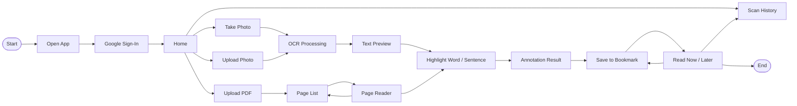
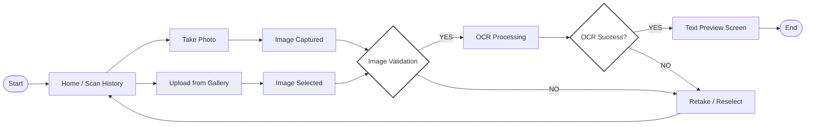
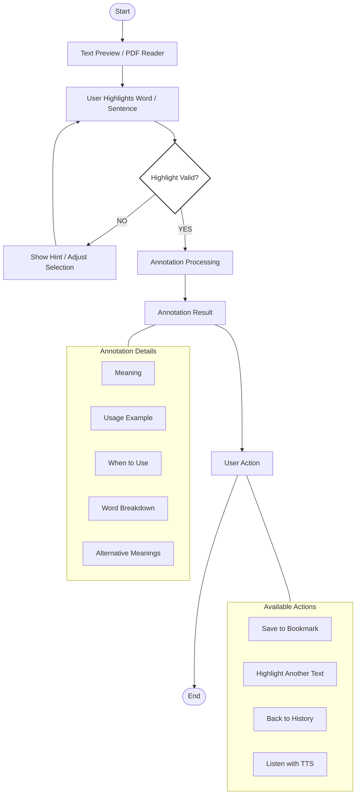
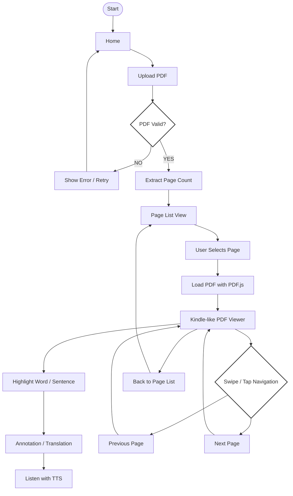
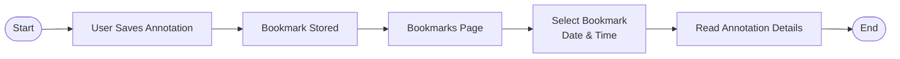

## 1. Background

Learning from physical books and digital documents is still a common method for language learners, especially for professional or work-related materials. However, traditional learning requires users to constantly switch between books, dictionaries, and online resources to understand unfamiliar words or sentences.

This product enables users to **scan book pages using their mobile device** or **upload PDF documents**, interact with the text, and **highlight words or sentences** to receive contextual explanations and translations. For physical books, OCR converts images to text. For PDFs, text is extracted directly — no OCR needed. The MVP focuses on Japanese work-related learning materials, starting with *Shigoto Japan*, but is designed to be scalable to other languages and content types in the future.

The app provides two equal input paths:
1. **Camera/Image path**: Scan physical book pages → OCR → text → annotate/translate/TTS
2. **PDF path**: Upload PDF → direct text extraction → Kindle-like page reader → annotate/translate/TTS

---

## 2. Objective

The primary objective of the MVP is to validate whether users find value in **learning Japanese from book content** — both physical (photographed) and digital (PDF) — using contextual annotations, translation, and text-to-speech.

Specific goals:

- Enable fast conversion of book images into readable text via OCR
- Enable reading and learning from PDF documents with a Kindle-like page reader
- Help users understand Japanese words or sentences in a professional context
- Allow users to save and revisit learning materials
- Deliver a usable MVP within 2 weeks

---

## 3. Success Metrics

| Metric                       | Description                                                        | Target (MVP) |
| ---------------------------- | ------------------------------------------------------------------ | ------------ |
| User Activation Rate         | Users who complete sign-in and upload at least one photo or PDF    | ≥ 60%        |
| OCR Success Rate             | Uploaded images successfully converted to readable text            | ≥ 85%        |
| PDF Text Extraction Rate     | Uploaded PDFs with successfully extracted text                     | ≥ 95%        |
| Annotation Usage             | Users who highlight and view at least one annotation               | ≥ 50%        |
| Bookmark Usage (Phase2)      | Users who save at least one annotation                             | ≥ 30%        |
| Returning Users (Phase2)     | Users who revisit previously scanned content or uploaded documents | ≥ 25%        |
| Average Annotation Load Time | Time to display annotation result                                  | ≤ 3 seconds  |

---

## 4. Assumptions

- Users are primarily **Japanese language learners for professional/work purposes**
- Users access the app mainly from **mobile devices**
- Image quality from user-uploaded photos is generally readable
- OCR accuracy for Japanese text is sufficient for MVP validation
- Initial content focus is limited to **Japanese → English** translation
- Users are comfortable signing in using Google Authentication
- Users have Japanese PDF documents (textbooks, work materials, digital books)
- PDFs contain selectable/extractable text (not scanned image-only PDFs)

---

## 5. Target Users

- Japanese language learners studying for professional/work contexts
- Professionals working with Japanese documents who need quick translations
- Students using Japanese textbooks who want contextual word/sentence explanations

---

## 6. Requirements

### 6.1. Functional Requirements

| Requirement               | Description                                              | User Story                                                                                                               | Priority |
| ------------------------- | -------------------------------------------------------- | ------------------------------------------------------------------------------------------------------------------------ | -------- |
| **User Authentication** (Phase1) | User can sign in using Google OAuth                | As a user, I want to sign in with my Google account so that I can quickly access the app without creating a new account. | High     |
| **Image Capture**         | User can take a photo using the camera                   | As a user, I want to take a photo of a book page so that I can instantly convert it into readable text.                  | High     |
| **Image Upload**          | User can upload an image from the gallery                | As a user, I want to upload an existing photo from my gallery so that I can use images I already have.                   | High     |
| **OCR Processing**        | Convert Japanese text from image to editable text        | As a user, I want the app to extract text from my photo so that I can read and interact with the content digitally.      | High     |
| **PDF Upload**            | User can upload a PDF document                           | As a user, I want to upload a PDF so I can read and learn from digital Japanese materials.                               | High     |
| **PDF Text Extraction**   | Extract text directly from PDF pages (no OCR needed)     | As a user, I want text from my PDF to be available instantly without waiting for OCR processing.                         | High     |
| **PDF Page Reader**       | Kindle-like page-by-page reading experience              | As a user, I want to read PDF pages one at a time like a book reader so the experience feels natural.                    | High     |
| **PDF Page Navigation**   | Swipe/tap to navigate between pages                      | As a user, I want to swipe between pages so I can read through the document naturally.                                   | High     |
| **Text Highlight**        | User can select words or sentences                       | As a user, I want to highlight specific words or sentences so that I can focus on parts I don't understand.              | High     |
| **Annotation Generation** | System provides contextual explanations                  | As a user, I want to see explanations and context for highlighted text so that I can understand its meaning and usage.   | High     |
| **Bookmark Annotation**   | User can save annotations                                | As a user, I want to bookmark annotations so that I can review them later.                                               | Medium   |
| **Annotation History**    | User can revisit previous annotations                    | As a user, I want to see my past annotations so that I can continue learning without repeating the same steps.           | Medium   |
| **Scan History**          | User can view previously uploaded images                 | As a user, I want to access my previous scans so that I can reread or annotate them again.                               | Medium   |
| **Document Library**      | User can view previously uploaded PDFs                   | As a user, I want to access my uploaded PDFs so that I can continue reading where I left off.                            | Medium   |
| **Language Preference**   | Default English, adjustable by user                      | As a user, I want to choose my preferred explanation language so that learning feels more comfortable to me.             | Low      |

### Annotation Output Requirements

| Type                | Description                                   |
| ------------------- | --------------------------------------------- |
| Meaning             | Direct translation of the word or sentence    |
| Usage Example       | Example sentence in professional/work context |
| When to Use         | When and in what situation the phrase is used |
| Word Breakdown      | Explanation of each word in a sentence        |
| Alternative Meaning | Meaning in different fields or contexts       |

---

### Non-Functional Requirements

| Category    | Requirement                                                            |
| ----------- | ---------------------------------------------------------------------- |
| Performance | Annotation response time ≤ 3 seconds                                  |
| Performance | PDF text extraction ≤ 1 second per page                                |
| Usability   | Optimized for mobile web                                               |
| Security    | OAuth-based authentication                                             |
| Scalability | OCR, PDF, and annotation services can be extended post-MVP             |
| Reliability | Saved data persists across sessions                                    |
| Limits      | Image upload max 10MB; PDF upload max 10MB                             |

## 7. User Interface

### 7.1 User Flow

**7.1.1 Happy Flow**

```mermaid
graph LR
    Start([Start]) --> OpenApp[Open App]
    OpenApp --> GoogleSignIn[Google Sign-In]
    GoogleSignIn --> Home[Home]

    Home --> ScanHistory[Scan History]
    Home --> TakePhoto[Take Photo]
    Home --> UploadPhoto[Upload Photo]
    Home --> UploadPDF[Upload PDF]

    TakePhoto --> OCR[OCR Processing]
    UploadPhoto --> OCR

    OCR --> TextPreview[Text Preview]

    UploadPDF --> PageList[Page List]
    PageList --> PageReader[Page Reader]

    TextPreview --> Highlight[Highlight Word / Sentence]
    PageReader --> Highlight

    Highlight --> Annotation[Annotation Result]
    Annotation --> Bookmark[Save to Bookmark]
    Bookmark --> Read[Read Now / Later]

    Read --> End([End])

    %% Optional Loops
    Read --> Bookmark
    Read --> ScanHistory
    PageReader --> PageList
```

**7.1.2 App Entry & Authentication**

```mermaid
graph LR
    Start([Start]) --> OpenApp[User Opens App]
    OpenApp --> Landing[Landing Page]
    Landing --> ClickSignIn[Click "Sign in with Google"]
    ClickSignIn --> GoogleOAuth[Google OAuth]
    GoogleOAuth --> AuthSuccess{Auth Success?}

    AuthSuccess -- YES --> Home[Home / Scan History Page]
    AuthSuccess -- NO --> ClickSignIn

    Home --> End([End])

    style AuthSuccess fill:#fff,stroke:#333,stroke-width:2px
    linkStyle 5 stroke:#28a745,stroke-width:2px,color:#28a745
    linkStyle 6 stroke:#dc3545,stroke-width:2px,color:#dc3545
```

**7.1.3 Image Capture / Upload Flow**

```mermaid
graph LR
    Start([Start]) --> Home[Home / Scan History]
    Home --> TakePhoto[Take Photo]
    Home --> UploadGallery[Upload from Gallery]

    TakePhoto --> ImageCaptured[Image Captured]
    UploadGallery --> ImageSelected[Image Selected]

    ImageCaptured --> Validation{Image Validation}
    ImageSelected --> Validation

    Validation -- YES --> OCR[OCR Processing]
    Validation -- NO --> Retake[Retake / Reselect]

    OCR --> OCRSuccess{OCR Success?}

    OCRSuccess -- YES --> TextPreview[Text Preview Screen]
    OCRSuccess -- NO --> Retake

    Retake --> Home
    TextPreview --> End([End])

    style Validation fill:#fff,stroke:#333,stroke-width:2px
    style OCRSuccess fill:#fff,stroke:#333,stroke-width:2px
```

**7.1.4 Text Interaction & Annotation Flow (Core Value)**

```mermaid
graph TD
    Start([Start]) --> TextPreview[Text Preview / PDF Reader]
    TextPreview --> Highlight[User Highlights Word / Sentence]
    Highlight --> Valid{Highlight Valid?}

    Valid -- NO --> Hint[Show Hint / Adjust Selection]
    Hint --> Highlight

    Valid -- YES --> Processing[Annotation Processing]
    Processing --> Result[Annotation Result]

    subgraph AnnotationDetails [Annotation Details]
        Meaning[Meaning]
        Usage[Usage Example]
        WhenToUse[When to Use]
        Breakdown[Word Breakdown]
        Alt[Alternative Meanings]
    end

    Result --- AnnotationDetails
    Result --> Action[User Action]

    subgraph Actions [Available Actions]
        Save[Save to Bookmark]
        HighlightAgain[Highlight Another Text]
        BackHistory[Back to History]
        TTS[Listen with TTS]
    end

    Action --- Actions
    Action --> End([End])

    style Valid fill:#fff,stroke:#333,stroke-width:2px
```

**7.1.5 PDF Reading Flow**

```mermaid
graph TD
    Start([Start]) --> Home[Home]
    Home --> UploadPDF[Upload PDF]
    UploadPDF --> Validation{PDF Valid?}

    Validation -- NO --> Error[Show Error / Retry]
    Error --> Home
    Validation -- YES --> Processing[Extract Page Count]

    Processing --> PageList[Page List View]
    PageList --> SelectPage[User Selects Page]
    SelectPage --> LoadPDF[Load PDF with PDF.js]
    LoadPDF --> Reader[Kindle-like PDF Viewer]

    Reader --> Highlight[Highlight Word / Sentence]
    Highlight --> Annotation[Annotation / Translation]
    Annotation --> TTS[Listen with TTS]

    Reader --> SwipeNav{Swipe / Tap Navigation}
    SwipeNav --> PrevPage[Previous Page]
    SwipeNav --> NextPage[Next Page]
    PrevPage --> Reader
    NextPage --> Reader

    Reader --> BackToList[Back to Page List]
    BackToList --> PageList

    style Validation fill:#fff,stroke:#333,stroke-width:2px
    style SwipeNav fill:#fff,stroke:#333,stroke-width:2px
```

**7.1.6 Bookmark & History Flow (Phase2)**

```mermaid
graph LR
    Start([Start]) --> Save[User Saves Annotation]
    Save --> Stored[Bookmark Stored]
    Stored --> Page[Bookmarks Page]
    Page --> Select[Select Bookmark <br/> Date & Time]
    Select --> Details[Read Annotation Details]
    Details --> End([End])
```

---

## 8. Technical Constraints

- PDF text extraction is for text-based PDFs only; scanned/image-only PDFs require OCR and are out of scope for MVP
- PDF page navigation is single-page-at-a-time (Kindle-style), not continuous scroll
- PDF rendering uses Mozilla's PDF.js library for canvas rendering with text layer selection
- Both image and PDF uploads share the same 10MB size limit

---

## 9. Out of Scope (MVP)

- Native mobile applications (iOS / Android)
- Non-Japanese language support
- Handwriting recognition
- Real-time camera OCR (live scanning)
- Grammar exercises or quizzes
- Social sharing features
- Subscription or payment system
- Teacher or community annotations
- Scanned/image-only PDFs (no embedded text)
- PDF annotation/markup (drawing on PDF)
- PDF editing or export
- Continuous scroll PDF reading (only page-by-page)
