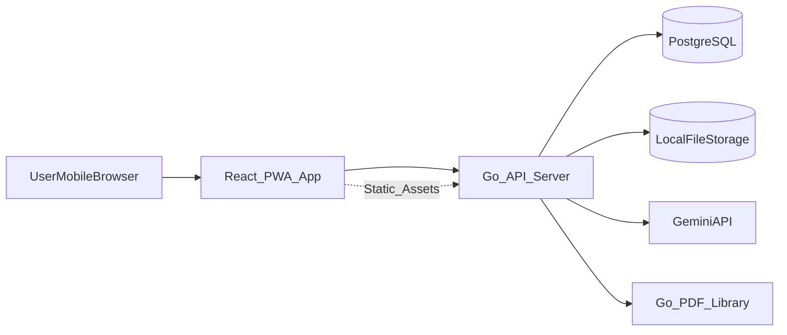
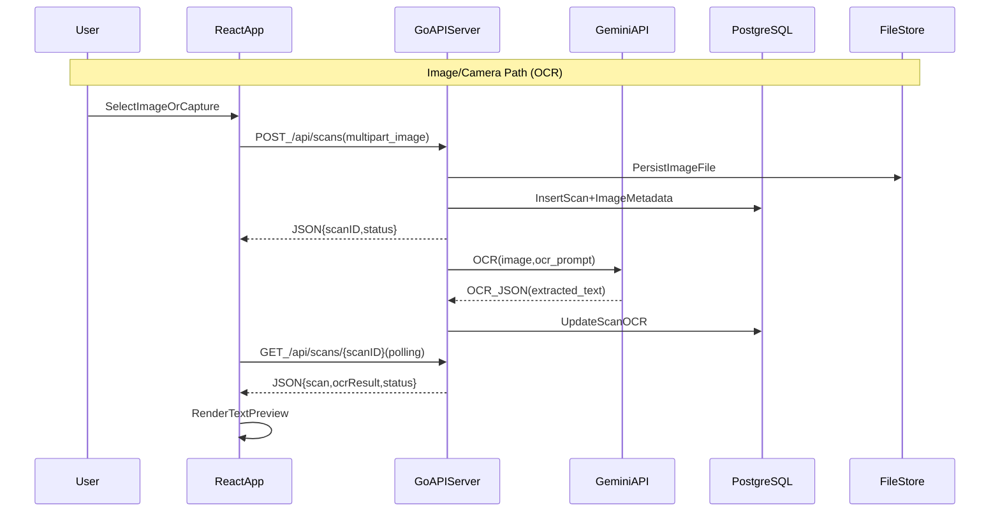
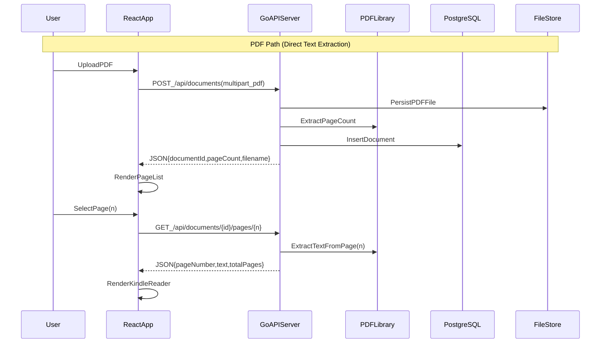
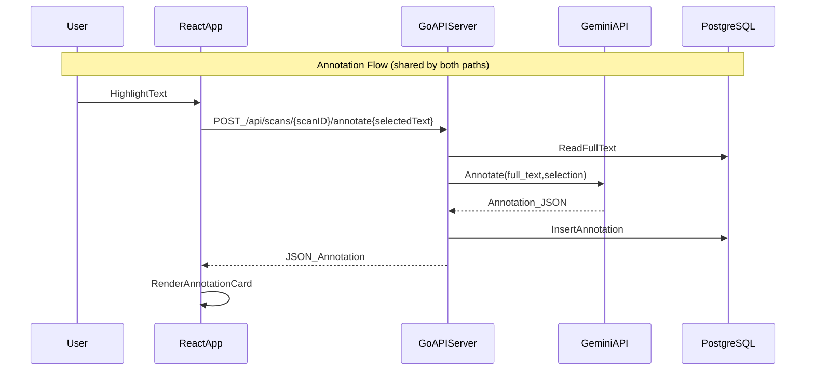
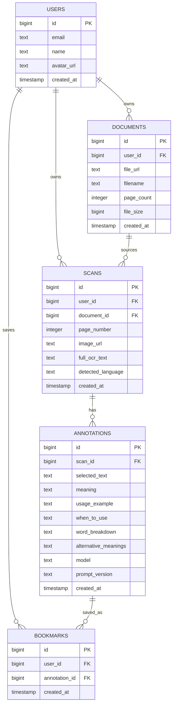

## RFC: Mobile-first PWA OCR+PDF Reader+Annotation (Go + React + Gemini)

### Status
Active - React frontend with Go API backend

### Summary
Build a **mobile-first PWA** with two equal input paths:
1. **Camera/Image**: upload/take a photo of a Japanese book page → **Gemini Flash OCR** to extract text
2. **PDF**: upload a PDF document → **direct text extraction** (no OCR needed) → **Kindle-like page-by-page reader**

Both paths feed into the same core value loop: users **highlight words/sentences** to get **contextual professional/work explanations** (meaning, usage example, when to use, word breakdown, alternative meanings) and **text-to-speech**.

### Goals
- **Fast OCR**: image → readable text preview (target OCR success rate ≥ 85% per PRD)
- **Instant PDF text**: PDF page → extracted text in ≤ 1 second (no Gemini API call)
- **Core value loop**: highlight → annotation within ≤ 3 seconds on average (PRD)
- **Kindle-like reader**: page-by-page navigation with swipe/tap for PDF documents
- **Mobile UX first**: React-driven UI optimized for touch selection and quick iteration
- **Persistence**: scans, documents, and annotations persist across sessions

### Non-goals (Phase0)
- Google OAuth (Phase1)
- Bookmark/history UI (Phase2)
- Offline OCR/annotation (PWA only caches shell/assets; API calls require network)
- Scanned/image-only PDFs (text-based PDFs only for MVP)
- Native apps, realtime live scanning, handwriting, quizzes (PRD out of scope)

### Scope
#### Phase0 (now): Image OCR + PDF Reader + Annotation
- **Image input**: upload from gallery (and optionally capture via browser camera input)
- **PDF input**: upload PDF document, extract text directly per page
- **OCR**: Gemini Flash vision OCR to extract Japanese text (image path only)
- **PDF reader**: Kindle-like page-by-page view with swipe/tap navigation
- **Text preview**: show extracted text (from OCR or PDF), allow selecting/highlighting
- **Annotation**: Gemini generates structured fields for highlighted text
- **TTS**: text-to-speech for Japanese text
- **Identity**: anonymous **session cookie** (no login)

#### Phase1 (next): PRD 7.1.2 AppEntryAuthentication
- Google OAuth sign-in
- Associate existing session data to a user upon login

#### Phase2 (next): PRD 7.1.6 BookmarkHistory
- Save/bookmark annotations
- Scan history + document library + annotation history pages

### User experience (Phase0 happy flows)

**Image path:**
- User opens app (PWA)
- User chooses **Take Photo** or **Upload from Gallery**
- App shows **OCR processing** state
- App shows **Text Preview**
- User highlights a word/sentence
- App shows **Annotation Result** with required fields
- User can highlight another phrase (loop) or use TTS

**PDF path:**
- User opens app (PWA)
- User chooses **Upload PDF**
- App uploads PDF and shows **Page List** (simple text list: Page 1, Page 2, ...)
- User taps a page
- App shows **Kindle-like Page Reader** with extracted text
- User swipes/taps to navigate between pages
- User highlights a word/sentence
- App shows **Annotation Result** with required fields
- User can highlight another phrase (loop) or use TTS

### Architecture
#### Monorepo Structure
```
gemini-hackathon/
├── backend/          # Go API server
│   ├── cmd/server/   # Application entry point
│   ├── internal/     # Internal Go packages
│   ├── migrations/   # Database migrations
│   └── go.mod        # Go module definition
├── web/              # React frontend
│   ├── src/         # React source code
│   ├── public/      # Static assets
│   ├── dist/        # Build output (gitignored)
│   └── package.json # Frontend dependencies
├── docs/             # Documentation
│   ├── rfc.md       # This file
│   ├── prd.md       # Product requirements
│   └── task.md      # Implementation tasks
└── image/           # Test images
```

#### Components
- **PWA client**: React SPA with shadcn/ui components, Tailwind CSS v4, optimized for mobile selection UX
- **Go web server**: API backend serving JSON responses; serves React static files from `web/dist/` in production
- **Gemini API client**: three calls
  - **OCR**: image → extracted text JSON (image path only)
  - **Annotation**: extracted text + selection → structured annotation JSON
  - **TTS**: Japanese text → speech audio
- **PDF text extraction**: Go PDF library extracts text per page (no Gemini API call)
- **PostgreSQL**: metadata + OCR text + documents + annotations; users/bookmarks later
- **File storage**: store uploaded images and PDFs on disk, DB stores path + hashes

#### PWA strategy
- `manifest.webmanifest` for installability
- Service worker caches the app shell + static assets for faster repeat loads
- OCR/annotation/PDF endpoints are **network-only** (no offline compute)

#### Gemini integration
- **Model**: Gemini Flash for OCR (vision) and annotation (text)
- **Output format**: JSON-first prompts so backend can store and render reliably
- **Prompt versioning**: store `prompt_version` with OCR/annotation for later iteration
- **Not used for PDF**: PDF text extraction is handled by Go PDF library, not Gemini

### API surface

#### JSON API Endpoints — Image/Scan
- **POST /api/scans**: multipart upload, returns JSON `{"scanID": "...", "status": "uploaded", "createdAt": "..."}`
- **GET /api/scans/{id}**: returns JSON `{"scan": {...}, "ocrResult": {...} | null, "status": "..."}`
- **POST /api/scans/{id}/annotate**: accepts JSON `{"selectedText": "..."}`, returns annotation JSON
- **GET /api/scans/{id}/image**: returns binary image data

#### JSON API Endpoints — PDF/Document
- **POST /api/documents**: multipart PDF upload, returns JSON `{"documentId": ..., "pageCount": ..., "filename": "..."}`
- **GET /api/documents/{id}**: returns document metadata `{"id": ..., "filename": "...", "pageCount": ..., "createdAt": "..."}`
- **GET /api/documents/{id}/pages/{n}**: extracts and returns text for page N `{"pageNumber": ..., "text": "...", "totalPages": ...}`
- **POST /api/documents/{id}/pages/{n}/scan**: creates scan record from PDF page text, returns `{"scanId": ...}`

#### Common Endpoints
- **GET /healthz**: basic health check

#### Static File Serving
- **GET /** (and all non-API routes): serves React SPA from `web/dist/`
- React Router handles client-side routing for all non-API paths

### Data model

#### Diagrams

```mermaid
flowchart LR
  User[UserMobileBrowser] --> ReactApp[React_PWA_App]
  ReactApp --> GoAPI[Go_API_Server]
  GoAPI --> PostgreSQL[(PostgreSQL)]
  GoAPI --> FileStore[(LocalFileStorage)]
  GoAPI --> Gemini[GeminiAPI]
  GoAPI --> PDFLib[Go_PDF_Library]

  ReactApp -.->|Static_Assets| GoAPI
```


```mermaid
sequenceDiagram
  participant U as User
  participant R as ReactApp
  participant S as GoAPIServer
  participant G as GeminiAPI
  participant D as PostgreSQL
  participant F as FileStore

  Note over U,F: Image/Camera Path (OCR)
  U->>R: SelectImageOrCapture
  R->>S: POST_/api/scans(multipart_image)
  S->>F: PersistImageFile
  S->>D: InsertScan+ImageMetadata
  S-->>R: JSON{scanID,status}
  S->>G: OCR(image,ocr_prompt)
  G-->>S: OCR_JSON(extracted_text)
  S->>D: UpdateScanOCR
  R->>S: GET_/api/scans/{scanID}(polling)
  S-->>R: JSON{scan,ocrResult,status}
  R->>R: RenderTextPreview
```


```mermaid
sequenceDiagram
  participant U as User
  participant R as ReactApp
  participant S as GoAPIServer
  participant P as PDFLibrary
  participant D as PostgreSQL
  participant F as FileStore

  Note over U,F: PDF Path (Direct Text Extraction)
  U->>R: UploadPDF
  R->>S: POST_/api/documents(multipart_pdf)
  S->>F: PersistPDFFile
  S->>P: ExtractPageCount
  S->>D: InsertDocument
  S-->>R: JSON{documentId,pageCount,filename}
  R->>R: RenderPageList

  U->>R: SelectPage(n)
  R->>S: GET_/api/documents/{id}/pages/{n}
  S->>P: ExtractTextFromPage(n)
  S-->>R: JSON{pageNumber,text,totalPages}
  R->>R: RenderKindleReader
```


```mermaid
sequenceDiagram
  participant U as User
  participant R as ReactApp
  participant S as GoAPIServer
  participant G as GeminiAPI
  participant D as PostgreSQL

  Note over U,D: Annotation Flow (shared by both paths)
  U->>R: HighlightText
  R->>S: POST_/api/scans/{scanID}/annotate{selectedText}
  S->>D: ReadFullText
  S->>G: Annotate(full_text,selection)
  G-->>S: Annotation_JSON
  S->>D: InsertAnnotation
  S-->>R: JSON_Annotation
  R->>R: RenderAnnotationCard
```


```mermaid
erDiagram
  USERS ||--o{ SCANS : owns
  USERS ||--o{ DOCUMENTS : owns
  DOCUMENTS ||--o{ SCANS : sources
  SCANS ||--o{ ANNOTATIONS : has
  USERS ||--o{ BOOKMARKS : saves
  ANNOTATIONS ||--o{ BOOKMARKS : saved_as

  USERS {
    bigint id PK
    text email
    text name
    text avatar_url
    timestamp created_at
  }
  DOCUMENTS {
    bigint id PK
    bigint user_id FK
    text file_url
    text filename
    integer page_count
    bigint file_size
    timestamp created_at
  }
  SCANS {
    bigint id PK
    bigint user_id FK
    bigint document_id FK
    integer page_number
    text image_url
    text full_ocr_text
    text detected_language
    timestamp created_at
  }
  ANNOTATIONS {
    bigint id PK
    bigint scan_id FK
    text selected_text
    text meaning
    text usage_example
    text when_to_use
    text word_breakdown
    text alternative_meanings
    text model
    text prompt_version
    timestamp created_at
  }
  BOOKMARKS {
    bigint id PK
    bigint user_id FK
    bigint annotation_id FK
    timestamp created_at
  }
```

#### Database schema (DDL)
```sql
-- Documents table (PDF uploads)
CREATE TABLE IF NOT EXISTS documents (
  id BIGSERIAL PRIMARY KEY,
  user_id BIGINT REFERENCES users(id),
  file_url TEXT NOT NULL,
  filename TEXT NOT NULL,
  page_count INTEGER NOT NULL,
  file_size BIGINT NOT NULL,
  created_at TIMESTAMP WITH TIME ZONE DEFAULT NOW()
);

CREATE INDEX IF NOT EXISTS idx_documents_user_id ON documents(user_id);

-- Add document link to scans table
-- (existing scans table gets two new nullable columns)
ALTER TABLE scans ADD COLUMN IF NOT EXISTS document_id BIGINT REFERENCES documents(id);
ALTER TABLE scans ADD COLUMN IF NOT EXISTS page_number INTEGER;
```

Note: The existing `scans`, `users`, and `annotations` tables are defined in `backend/migrations/001_initial_database_schema.sql`. The above DDL shows only the new additions for PDF support.

### Frontend Architecture

#### React App Stack
- **Package Manager**: Bun (fast installs, built-in test runner)
- **Build Tool**: Vite (fast HMR, optimized production builds)
- **Language**: TypeScript
- **UI Framework**: React 18+
- **Component Library**: shadcn/ui (Tailwind v4 compatible)
- **Styling**: Tailwind CSS v4 (via `@tailwindcss/vite` plugin)
- **Testing**: Vitest (with React Testing Library, target ≥80% coverage)
- **Routing**: React Router v6
- **Data Fetching**: TanStack Query (React Query) for API calls
- **State Management**: React Query + Context API (minimal global state)
- **PWA**: Vite PWA Plugin
- **Form Handling**: React Hook Form

#### Frontend Component Structure
```
web/src/
├── pages/                    # Page components
│   ├── HomePage.tsx
│   ├── WelcomePage.tsx       # Entry: Take Photo / Upload Image / Upload PDF
│   ├── ScanPage.tsx          # Image scan text preview + annotation
│   ├── DocumentPage.tsx      # NEW: PDF page list + Kindle reader
│   ├── LoadingPage.tsx       # OCR loading state
│   ├── CameraPage.tsx        # Camera capture
│   └── NotFoundPage.tsx
├── components/
│   ├── ui/                   # shadcn/ui components
│   ├── homepage/             # HomePage-specific components
│   ├── scanpage/             # ScanPage-specific components
│   └── documentpage/         # NEW: PDF reader components
│       ├── PageList.tsx      # Simple page number list
│       ├── PageReader.tsx    # Kindle-like text reader with navigation
│       └── PageNavigator.tsx # Swipe/tap prev/next controls
├── hooks/                    # Custom React hooks
│   ├── useScan.ts
│   ├── useAnnotation.ts
│   ├── useTextSelection.ts
│   └── useDocument.ts       # NEW: Document data fetching + page navigation
├── lib/                      # Utilities, API client, types
│   ├── api.ts               # API client functions
│   ├── types.ts             # TypeScript types
│   └── utils.ts             # Utility functions
└── test/                     # Test setup and utilities
```

#### Backend Package Structure
```
backend/
├── cmd/server/              # Application entry point
│   └── main.go              # HTTP server setup and routing
├── internal/
│   ├── config/              # Configuration loading
│   ├── handlers/            # HTTP handlers (JSON API)
│   │   ├── scan.go          # Image scan handlers
│   │   └── document.go      # NEW: PDF document handlers
│   ├── middleware/          # Session, logging middleware
│   ├── models/              # Data models
│   │   ├── scan.go
│   │   └── document.go      # NEW: Document model
│   ├── storage/             # Database and file storage
│   ├── gemini/              # Gemini API client
│   ├── pdf/                 # NEW: PDF text extraction
│   └── testutil/            # Test helpers and mocks
└── migrations/              # Database migrations
    ├── 001_initial_database_schema.sql
    └── 002_add_documents.sql  # NEW: Documents table + scan columns
```

#### Build Integration

**Development**:
- React dev server runs on `http://localhost:5173` (Vite default)
- Go server runs on `http://localhost:8080`
- Vite proxy configured to forward `/api/*` to Go server
- Run both: `cd web && bun run dev` (frontend) and `cd backend && go run cmd/server/main.go` (backend)

**Production**:
- React app builds to `web/dist/` (via `cd web && bun run build`)
- Go server serves static files from `web/dist/` directory
- Go server handles `/api/*` routes, everything else serves React app (SPA routing)
- Build backend: `cd backend && go build -o ../server ./cmd/server`
- Run: `./server` (from root directory)

### Technology Stack Decisions

#### Frontend: React + TypeScript + Vite

**Why React**:
- Rich ecosystem (shadcn/ui, React Query, etc.)
- Excellent state management solutions
- Component reusability and composition
- Strong TypeScript support
- Better mobile UX libraries and patterns
- Modern tooling (Vite, HMR, etc.)
- Easier to implement complex interactions (Kindle-like reader, swipe gestures)
- Large community and resources

**Why TypeScript**:
- Type safety for API contracts
- Better IDE support and autocomplete
- Catch errors at compile time
- Improved maintainability

**Why Vite**:
- Fast HMR for development
- Optimized production builds
- Built-in PWA plugin support
- Modern ES modules

**Why shadcn/ui**:
- Accessible components out of the box
- Tailwind CSS v4 compatible
- Mobile-optimized components
- Easy customization

#### Backend: Go

**Why Go**:
- Fast compilation and execution
- Excellent standard library for HTTP servers
- Simple concurrency model (goroutines)
- Good PostgreSQL support
- Small binary size
- Cross-platform support
- Pure Go PDF libraries available (no CGO dependency)

#### PDF Text Extraction: Go PDF Library

**Why Go PDF library (not Gemini)**:
- PDFs contain embedded digital text — OCR is unnecessary
- Direct extraction is instant (< 1 second) vs Gemini API call (1-3 seconds)
- No API cost per page extraction
- Works offline (no network dependency for text extraction)

**Recommended library**: `github.com/ledongthuc/pdf` or `github.com/dslipak/pdf`
- Pure Go (no CGO dependency)
- Lightweight, focused on text extraction
- Alternative: `pdfcpu` (more features but heavier)

### Tasks
#### Phase0: Core happy flow (Image OCR + PDF Reader + Annotation)
- [x] Add base Go web server (API backend)
- [x] Migrate to React frontend
  - [x] Setup Bun workspace and React app with Vite
  - [x] Install Tailwind CSS v4 and shadcn/ui
  - [x] Create React components (HomePage, ScanPage, components)
  - [x] Implement custom hooks (useScan, useAnnotation, useTextSelection)
  - [x] Setup API client and TypeScript types
  - [x] Restructure monorepo: backend/, web/, docs/, image/
- [x] Add JSON API endpoints
  - [x] POST /api/scans
  - [x] GET /api/scans/{id}
  - [x] POST /api/scans/{id}/annotate
  - [x] GET /api/scans/{id}/image
- [x] Static file serving
  - [x] Go server serves React SPA from `web/dist/`
  - [x] SPA routing for all non-API routes
- [ ] PDF document support
  - [ ] Database migration: `documents` table + `scans` columns
  - [ ] PDF upload endpoint: POST /api/documents
  - [ ] PDF text extraction: GET /api/documents/{id}/pages/{n}
  - [ ] PDF-to-scan bridge: POST /api/documents/{id}/pages/{n}/scan
  - [ ] WelcomePage: Add "Upload PDF" button
  - [ ] DocumentPage: Page list view
  - [ ] DocumentPage: Kindle-like page reader with swipe/tap navigation
  - [ ] useDocument hook for data fetching + page state
- [ ] Implement session cookie identity
  - [ ] Create/read session cookie
  - [ ] Update `sessions.last_seen_at`
- [ ] Implement image upload handling
  - [ ] Validate mime/size
  - [ ] Persist image to local storage
  - [ ] Create `scans` + `scan_images` rows
- [ ] Gemini Flash OCR
  - [ ] OCR prompt (JSON output with extracted text)
  - [ ] Store `ocr_results` (raw_text + structured_json + prompt_version)
  - [ ] OCR failure handling + retry UX
- [ ] Text preview UI
  - [ ] Render extracted text with selection guidance for mobile
  - [ ] Capture selection payload (selected_text, optional start/end offsets)
- [ ] Annotation generation
  - [ ] Annotation prompt constrained to PRD output fields
  - [ ] Parse + validate response
  - [ ] Store `annotations`
  - [ ] Render result (Meaning, Usage Example, When to Use, Word Breakdown, Alternative Meanings)
- [ ] Performance + safety
  - [ ] Timeouts and request size limits
  - [ ] Basic rate limiting per session (optional for MVP)
  - [ ] Logging + correlation IDs per scan

#### Phase1: Authentication (7.1.2 AppEntryAuthentication)
- [ ] Google OAuth flow (login, callback, logout)
- [ ] `users` table population + uniqueness rules (provider, subject)
- [ ] Session-to-user association (on login)
- [ ] Protect user-specific pages/endpoints where needed

#### Phase2: Bookmark & history (7.1.6 BookmarkHistory)
- [ ] Save bookmark action on annotation result
- [ ] Bookmarks page (list by date/time) + detail view
- [ ] Scan history page (list scans) + scan detail
- [ ] Document library (list uploaded PDFs) + continue reading
- [ ] Annotation history (optional: per scan and global)
