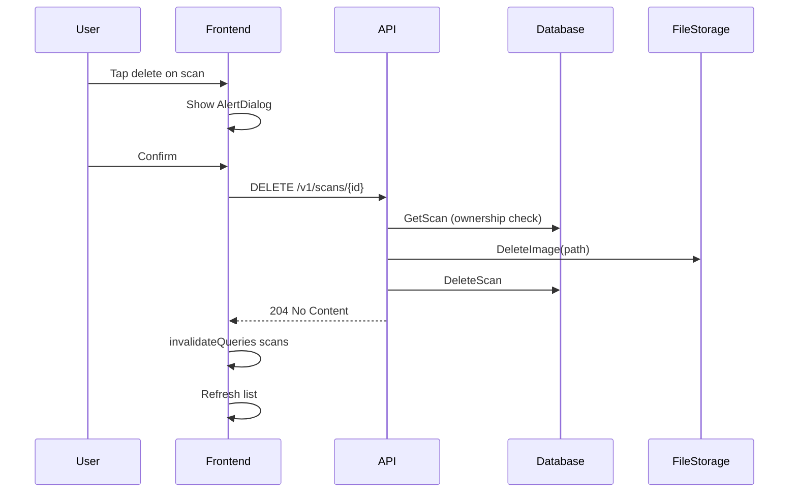
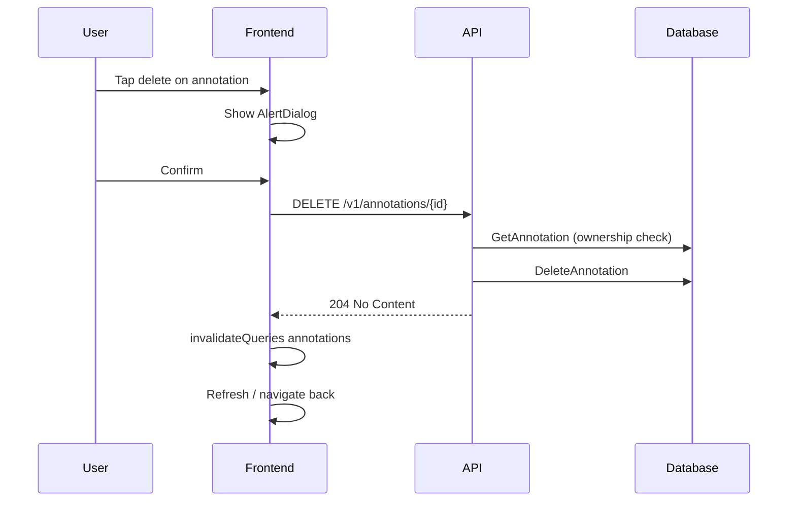
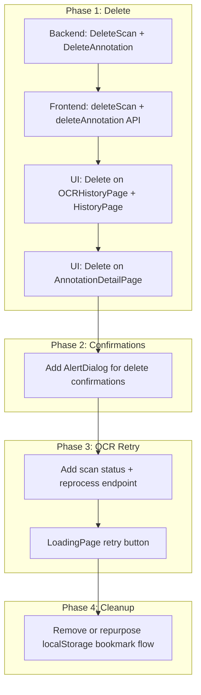

# Enhancement Plan: OCR + Annotation PWA

## 1. User Stories

- **US-1:** As a user, I want to delete a scan from my OCR history so that I can remove unwanted or incorrect scans. Priority: High
- **US-2:** As a user, I want to delete an annotation from history or detail view so that I can clean up saved annotations I no longer need. Priority: High
- **US-3:** As a user, I want a confirmation dialog before delete so that I can avoid accidental removal. Priority: Medium
- **US-4:** As a user, I want to delete a scan from the scan detail page so that I can remove it without returning to history first. Priority: Low

## 2. Acceptance Criteria

- **AC-1:** Given a user owns a scan, When they tap delete on OCR History and confirm, Then the scan is removed from the list and the image file is deleted from storage.
- **AC-2:** Given a user does not own a scan, When they call DELETE /v1/scans/{id}, Then the API returns 403 Forbidden.
- **AC-3:** Given a scan ID that does not exist, When DELETE /v1/scans/{id} is called, Then the API returns 404 Not Found.
- **AC-4:** Given a user owns an annotation, When they tap delete on History or Detail page and confirm, Then the annotation is removed and the list/detail updates.
- **AC-5:** Given a user does not own an annotation, When they call DELETE /v1/annotations/{id}, Then the API returns 403 Forbidden.
- **AC-6:** Given an annotation ID that does not exist, When DELETE /v1/annotations/{id} is called, Then the API returns 404 Not Found.
- **AC-7:** Given the user is about to delete, When the confirmation dialog is shown, Then they can cancel to abort the action.
- **AC-8:** Given a scan is deleted, When annotations referenced that scan, Then annotations remain in History with scan_id set to null (orphaned but visible).

## 3. Edge Cases

**Input validation**
- Empty/invalid scan ID: non-numeric, zero, negative → 400 Bad Request
- Empty/invalid annotation ID: non-numeric, zero, negative → 400 Bad Request

**Error handling**
- Network failure during delete: show toast, leave list unchanged
- Timeout: return 408/504, user can retry
- Concurrent delete: second request gets 404; first succeeds

**Boundary conditions**
- Delete last scan in list: show empty state
- Delete last annotation: show empty state
- Delete scan with many annotations: cascade SET NULL; no orphan limit

**Integration**
- DB unavailable: return 500, log error
- File storage delete fails: log, optionally still delete DB row (or fail atomically per product choice)

**Performance**
- Delete should complete within 2s for typical scan+image

## 4. Technical Architecture

**Architecture decisions**
- Ownership check before delete: Always verify `user_id` matches resource owner; prevents cross-user deletion.
- Delete image file before DB row: Ensures storage cleanup; if DB delete fails, image may be orphaned (acceptable for MVP).
- Reuse `FileStorage.DeleteImage`: Already exists in [backend/internal/storage/file.go](backend/internal/storage/file.go); no new storage abstraction needed.

**Design patterns**
- Repository pattern: DB interface for `DeleteScan`, `DeleteAnnotation`
- Handler-per-resource: `DeleteScanAPI`, `DeleteAnnotationAPI` in existing handler structs
- Optimistic UI: `invalidateQueries` after mutation; React Query refetches

**Technical diagrams**

---

## Current State Summary

**Architecture:** Go backend (Postgres) + React frontend. Scans store image URLs and OCR text; annotations link to scans via `scan_id` (nullable, `ON DELETE SET NULL`).

**Data flows:**

- **HistoryPage** (`/history`) – uses `useAnnotations` → API `getAnnotations` (backend)
- **OCRHistoryPage** (`/scans-history`) – uses `useScans` → API `getScans` (backend)
- **BookmarkCard/BookmarkList** – use `useBookmarks` → `storage.ts` (localStorage only). These components are not rendered in any route.

**Gaps:**

- No `DELETE` endpoints for scans or annotations
- No `DeleteScan` / `DeleteAnnotation` in [backend/internal/storage/db.go](backend/internal/storage/db.go) DB interface
- [backend/internal/storage/file.go](backend/internal/storage/file.go) has `DeleteImage` but it is never used
- OCR failure: [processOCR](backend/internal/handlers/scan.go) logs errors but does not update scan status; [LoadingPage](web/src/pages/LoadingPage.tsx) times out after 30s with no retry

---

## 1. Delete for Scans (OCR)

**Scope:** Let users remove scans from OCR History with cascade cleanup.

**Backend:**

- Add `DeleteScan(ctx, scanID, userID) error` to DB interface in [backend/internal/storage/db.go](backend/internal/storage/db.go)
- Implement: check ownership, delete scan row (DB cascades: annotations get `scan_id = NULL` per schema)
- In handler: resolve image path from `scan.ImageURL`, call `fileStorage.DeleteImage`, then `db.DeleteScan`
- New route: `DELETE /v1/scans/{id}` in [backend/cmd/server/main.go](backend/cmd/server/main.go)

**Frontend:**

- Add `deleteScan(scanId)` in [web/src/lib/api.ts](web/src/lib/api.ts)
- Add delete button (e.g. trash icon) to each item in [web/src/pages/OCRHistoryPage.tsx](web/src/pages/OCRHistoryPage.tsx)
- Optional: add delete on [ScanPage](web/src/pages/ScanPage.tsx) header (e.g. overflow menu)
- Use `useMutation` + `queryClient.invalidateQueries(['scans'])` for UI refresh

**Data model note:** `annotations.scan_id` is `ON DELETE SET NULL`, so deleting a scan leaves annotations orphaned but visible under History. If product wants annotations removed when scan is deleted, add `ON DELETE CASCADE` via migration.

---

## 2. Delete for Annotations

**Scope:** Let users remove annotations from History and optionally from Annotation Detail.

**Backend:**

- Add `DeleteAnnotation(ctx, annotationID, userID) error` to DB interface in [backend/internal/storage/db.go](backend/internal/storage/db.go)
- Implement: check ownership, delete annotation row
- New route: `DELETE /v1/annotations/{id}` in [backend/cmd/server/main.go](backend/cmd/server/main.go)

**Frontend:**

- Add `deleteAnnotation(annotationId)` in [web/src/lib/api.ts](web/src/lib/api.ts)
- Add delete action to [web/src/pages/HistoryPage.tsx](web/src/pages/HistoryPage.tsx) list items (e.g. swipe or button)
- Add delete button on [web/src/pages/AnnotationDetailPage.tsx](web/src/pages/AnnotationDetailPage.tsx) (header or footer)
- Use `useMutation` + `queryClient.invalidateQueries(['annotations'])`

**UX:** Add confirmation dialog (e.g. "Remove this annotation?") before calling delete.

---

## 3. Other Enhancement Ideas

### 3.1 OCR Re-run / Retry

**Problem:** When OCR fails, `processOCR` does not update scan status. LoadingPage shows "Failed to load scan" with only "Go back", no retry.

**Options:**

- **A:** Add `POST /v1/scans/{id}/reprocess-ocr` to re-run OCR from stored image (requires reading image from disk/URL)
- **B:** Add scan status (`pending`, `done`, `failed`) in DB; on failure set `failed`; LoadingPage shows retry button that calls reprocess endpoint
- **C:** Keep current flow but add explicit "Retry OCR" on LoadingPage that calls a reprocess endpoint

**Recommendation:** Add scan status + reprocess endpoint. Store `status` in `scans` table; `processOCR` sets `failed` on error. Reprocess endpoint: validate ownership, read image from storage, call `processOCR` again.

---

### 3.2 Unify / Clean Up Bookmark Logic

**Current:** `BookmarkCard`, `BookmarkList`, `useBookmarks`, `storage.ts` use localStorage. History uses API. Bookmarks are not shown in any route.

**Options:**

- **A:** Remove localStorage bookmark flow and rely on API (annotations are already "saved" via `createAnnotation`; History shows them)
- **B:** Add a "Bookmarks" tab/view that shows API annotations filtered by `is_bookmarked` (if backend supports)
- **C:** Keep localStorage for offline/premium use and sync later

**Recommendation:** If product does not need a separate bookmarks view, remove `BookmarkCard`, `BookmarkList`, `useBookmarks`, and `storage.ts` to reduce confusion. History already serves as the saved-annotations list.

---

### 3.3 Confirmation Before Delete

Use a shared confirmation dialog (e.g. shadcn AlertDialog) for:

- Delete scan: "Remove this scan and its image? Annotations will remain in History."
- Delete annotation: "Remove this annotation?"

---

### 3.4 Scan Page Delete

Add a delete option on ScanPage (e.g. header menu) so users can remove a scan while viewing it, then redirect to `/scans-history`.

---

### 3.5 Search / Filter in History

Filter by highlighted text or date range on HistoryPage to help users find annotations quickly.

---

## Implementation Order

---

## Files to Modify

| Area     | File                              | Change                                                         |
| -------- | --------------------------------- | -------------------------------------------------------------- |
| Backend  | `internal/storage/db.go`          | Add `DeleteScan`, `DeleteAnnotation`                           |
| Backend  | `internal/handlers/scan.go`       | Add `DeleteScanAPI`, route `DELETE /v1/scans/{id}`             |
| Backend  | `internal/handlers/annotation.go` | Add `DeleteAnnotationAPI`, route `DELETE /v1/annotations/{id}` |
| Backend  | `cmd/server/main.go`              | Register DELETE routes                                         |
| Frontend | `lib/api.ts`                      | Add `deleteScan`, `deleteAnnotation`                           |
| Frontend | `pages/OCRHistoryPage.tsx`       | Delete button + mutation                                       |
| Frontend | `pages/HistoryPage.tsx`           | Delete button + mutation                                       |
| Frontend | `pages/AnnotationDetailPage.tsx`  | Delete button + mutation                                       |

---

## Implementation Steps

1. **Backend: DB interface and handlers**
   - Add `DeleteScan(ctx, scanID, userID) error` and `DeleteAnnotation(ctx, annotationID, userID) error` to DB interface
   - Implement both in `postgresDB`; for DeleteScan, annotations cascade via `ON DELETE SET NULL`
   - Add `DeleteScanAPI`: parse ID, get scan, check ownership, resolve image path, call `DeleteImage`, call `DeleteScan`
   - Add `DeleteAnnotationAPI`: parse ID, get annotation, check ownership, call `DeleteAnnotation`
   - Register `DELETE /v1/scans/{id}` and `DELETE /v1/annotations/{id}` in main.go (route to correct handler for `/v1/scans/` and `/v1/annotations/`)

2. **Frontend: API client**
   - Add `deleteScan(scanId: number)` and `deleteAnnotation(annotationId: number)` in `lib/api.ts`
   - Use `fetch` with `method: 'DELETE'`, `getAuthHeaders()`, handle 403/404 via `handleResponse`

3. **Frontend: OCR History delete**
   - Add delete button (Trash2 icon) to each scan item in `OCRHistoryPage.tsx`
   - Use `useMutation` with `deleteScan`, `onSuccess` invalidate `['scans']`
   - Add AlertDialog: "Remove this scan and its image? Annotations will remain in History." with Cancel/Confirm

4. **Frontend: History delete**
   - Add delete button to each annotation item in `HistoryPage.tsx`
   - Use `useMutation` with `deleteAnnotation`, invalidate `['annotations']`
   - Add AlertDialog: "Remove this annotation?"

5. **Frontend: Annotation Detail delete**
   - Add delete button in header or footer of `AnnotationDetailPage.tsx`
   - Same mutation + AlertDialog; on success navigate to `/history`

6. **Optional: Scan Page delete**
   - Add overflow/dropdown menu to Header with Delete option
   - On delete success, navigate to `/scans-history`

## Verification Checklist

- [ ] All user stories (US-1 through US-4) addressed
- [ ] All acceptance criteria (AC-1 through AC-8) met
- [ ] Edge cases handled (invalid IDs, 403, 404, network errors)
- [ ] Code follows project style (Go: backend/CLAUDE.md; React: web/CLAUDE.md)
- [ ] Functions reused where possible (DeleteImage, existing handler patterns)
- [ ] Technical diagrams included
- [ ] Tests: `cd backend && go test ./...`; `cd web && bun run test && bun run build`
- [ ] Manual: delete scan from OCR History, confirm image removed
- [ ] Manual: delete annotation from History and Detail, confirm removal
